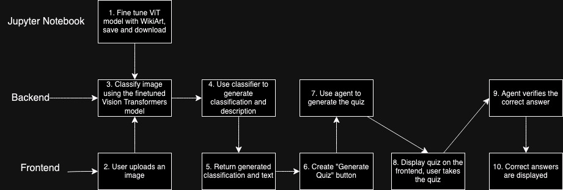

# Encode Final Project

This Encode student project is a web application that allows users to upload an image (preferably of a piece of art) to determine what style it is, provide a description, and quiz the user on what the classifier detects. The application uses a Vision Transformers machine learning model for image classification and a backend AI Agent that generates a prediction of what is in the image and a description as well as a quiz for the user to test their knowledge. I've included the option of using a fine-tuned version of the Vision Transformers model in the server.py file.

## Features

- Upload an image (preferably of art).
- Detect what's in the picture using the Vision Transformers model.
- Click "Generate Quiz" to test your knowledge of what's in the image.
- Answer the questions and submit to see your score.

## App Flow

## Prerequisites

- Node.js and npm
- Python 3.10 (PyTorch is not compatible with versions past 3.10)
- Git
- Jupyter Notebook, Jupyter Notebook Extension (VSCode)

## Setup Instructions

### 1. Clone the Repository
`git clone https://github.com/AAlcazar5/encode-final-project`

### 2. Install Frontend Packages
`npm install`

### 3. Install Backend Packages
Navigate to the `backend` directory and create a virtual environment:
`cd ../backend`
`python3.10 -m venv venv`
`source venv/bin/activate` # On Windows use `venv\Scripts\activate`

Install the required Python packages:
`pip install -r requirements.txt`

### 4. Set Up Environment Variables
Create a ".env" file in the root directory and add the following environment variables:
OPENAI_API_KEY=your_openai_api_key

### 5. Run the Application
`npm run dev`

#### Start the Backend Server
In the "backend" directory, run:
`uvicorn server:app --reload --port 8000`

#### Start the Frontend Server
npm run dev

### 6. Access the Application

- Frontend: Open your browser and go to `http://localhost:3000`
- Backend: The backend server runs on `http://localhost:8000`

## Usage

1. Open the frontend in your browser.
2. Upload an image (preferably of art if you are using the fine-tuned classifier) using the "Upload Image" button.
3. The application will display the detected image and provide what it is and a description.
4. Click "Generate Quiz" to generate your quiz, click your answers and "Submit" to view your score.

## OPTIONAL
- A jupyter notebook showcasing how to finetune a model is also included in the repo. 
- The model was finetuned with a WikiArt Kaggle repo https://www.kaggle.com/datasets/sivarazadi/wikiart-art-movementsstyles.
  - However, you can pick whatever data source you'd like
- To use Jupyter Notebook: 
  - open the "final_vit_finetune.ipynb" file
  - Activate the kernel on the top right hand side of your page (given you're using VSCode with the Jupyter Notebook Extension)
    - Select your Python virtual environment
  - Run the commands (note, the training step takes a while to finish...depends on your compute power/ how many epochs you run
    - check step 10, Training arguments is setup to change the amount of epochs
  - Once your model is saved, you can use it in Server.py!
    - `model = ViTForImageClassification.from_pretrained(filepath/to/your/model/here)`

## Notes

- Ensure that your Python version is 3.10 or lower, as PyTorch is not compatible with versions past 3.10.
- The frontend runs on `localhost:3000` and the backend runs on `localhost:8000`.

## Contributing

Feel free to submit issues or pull requests if you have suggestions or improvements.

## License

This project is licensed under the MIT License.

